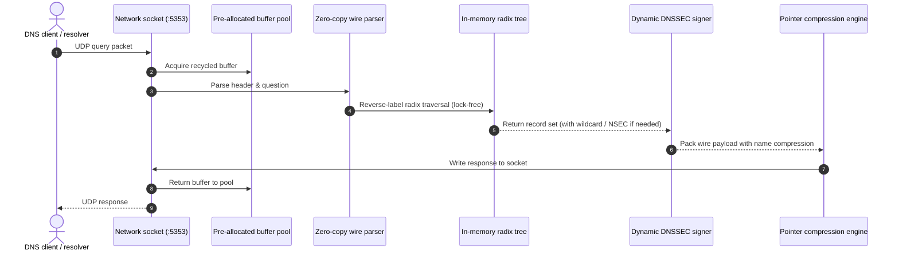

# Architecture and concurrency

KDNS uses the **Command Query Responsibility Segregation (CQRS)** pattern to separate the fast DNS query path (the data plane) from mutations, replication, and telemetry (the control plane).

```
                                +---------------------------+
                                |      Incoming queries     |
                                |  UDP / TCP / DoT / DoH    |
                                +-------------+-------------+
                                              |
                                              v
+---------------------------------------------+---------------------------------------------+
| DATA PLANE (Lock-free read path)                                                          |
|                                                                                           |
|  +---------------------+      +---------------------+      +---------------------------+  |
|  | Socket listener     | ---> | Pre-allocated pools | ---> | Radix tree router         |  |
|  | UDP / TCP / DoT/DoH |      | Zero-GC byte slices |      | Atomic pointer (CoW)      |  |
|  +---------------------+      +---------------------+      +-------------+-------------+  |
|                                                                          |                |
|                                                                          v                |
|  +---------------------+      +---------------------+      +---------------------------+  |
|  | Network response    | <--- | Wire packing engine | <--- | Sharded LRU cache         |  |
|  | UDP / TCP length    |      | Pointer compression |      | 256 shards (Bitwise mod)  |  |
|  +---------------------+      +---------------------+      +---------------------------+  |
+-------------------------------------------------------------------------------------------+

                                              ^
                                              | (Atomic swap & cache invalidation)
                                              |
+---------------------------------------------+---------------------------------------------+
| CONTROL PLANE & STORAGE (Serialized write path)                                           |
|                                                                                           |
|  +---------------------+      +---------------------+      +---------------------------+  |
|  | REST API :8080      | ---> | Bounded queue       | ---> | Group commit batch worker |  |
|  | RFC 2136 UPDATE     |      | 10,000 operations   |      | Batches <= 512 mutations  |  |
|  +---------------------+      +---------------------+      +-------------+-------------+  |
|                                                                          |                |
|                                                                          v                |
|  +---------------------+      +---------------------+      +---------------------------+  |
|  | Cluster hub :8081   | <--- | Background compact  | <--- | Write-Ahead Log (WAL)     |  |
|  | HTTP chunked stream |      | Deflate snapshot    |      | Sequential disk sync      |  |
|  +---------------------+      +---------------------+      +---------------------------+  |
+-------------------------------------------------------------------------------------------+
```

---

## 1. Port layout and traffic separation

Each network listener runs on its own dedicated port:

| Service | Port | Transport | Purpose | Security profile |
| :--- | :--- | :--- | :--- | :--- |
| **DNS UDP/TCP** | `5353` | UDP / TCP | Authoritative query resolution (RFC 1034/1035) | Public / Internet-facing |
| **DNS-over-TLS (DoT)** | `853` | TCP / TLS | Encrypted DNS queries (RFC 7858) | Public / Internet-facing |
| **DNS-over-HTTPS (DoH)** | `8443` | TCP / HTTP/2 | Dedicated RFC 8484 endpoint (`/dns-query`) | Public / Web-facing |
| **Management REST API** | `8080` | TCP / HTTP | CRUD operations, zone export, probes, Prometheus `/metrics` | Private / Bearer Auth |
| **Cluster WAL Streaming** | `8081` | TCP / HTTP(S) | Primary-to-replica WAL replication and snapshot transfer | Private / Cluster Network |

---

## 2. The zero-allocation query pipeline

The data plane avoids heap allocations on the hot path by recycling buffers from memory pools and serving pre-encoded wire payloads:



### Key implementation details:
1. **Stack-allocated iterators:** Domain labels are parsed right to left and lowercased directly inside a 64-byte stack buffer, bypassing the garbage collector completely.
2. **Pre-rendered payloads:** Resource records are stored in memory already packed in binary wire format, so the server does not need to re-encode them per query.
3. **Fixed pointer compression table:** DNS name compression offsets use a small stack-allocated array instead of dynamic slices.

---

## 3. How mutations are committed

Write requests (from the REST API or RFC 2136 dynamic updates) use an asynchronous group-commit pipeline:

1. **Queueing:** The mutation is wrapped with a completion channel and pushed into a bounded queue (10,000 slots).
2. **Batching:** A background worker collects up to 512 operations per micro-batch or flushes after a 2ms deadline.
3. **Commit step:**
   - Takes the storage write lock.
   - Applies changes to the in-memory tree using Copy-on-Write branch cloning.
   - Writes binary frames to `mutations.wal` with a single sequential disk sync.
   - Clears the sharded LRU query cache.
   - Wakes up connected cluster replicas with the new WAL offset.
   - Signals completion back to the waiting HTTP handlers.
4. **Consistency:** The HTTP request blocks until its batch is safely synced to disk, giving the caller immediate read-your-writes guarantees.

---

## 4. Signal handling

- **`SIGINT` / `SIGTERM` (Clean shutdown):** Closes HTTP and DoH listeners, drains in-flight queries within 5 seconds, flushes all pending WAL frames to disk, and closes storage files.
- **`SIGHUP` (Hot reload):** Reloads TLS certificates and keys without dropping connections. If a zone file is configured, it re-parses the file into a fresh offline tree and swaps the root pointer atomically.
