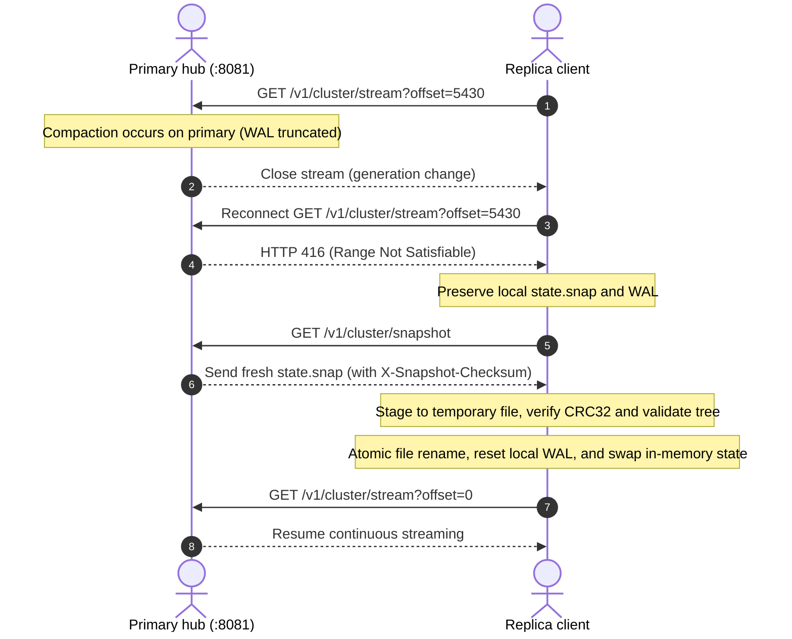

# High availability and replication

KDNS uses a lightweight **Primary / replica (active / read-only)** replication model designed for fast failover and multi-datacenter deployment.

A formal **OpenAPI 3.0 specification** describing the cluster endpoints (`/v1/cluster/stream`, `/v1/cluster/snapshot`) is available in [`api/openapi.yaml`](../api/openapi.yaml).

```
+-------------------------------------------------------------+
|                      PRIMARY NODE                           |
|                                                             |
|  [REST API] ----> [Storage Engine] ----> [Radix Tree]       |
|                          |                                  |
|                 [Cluster Hub :8081]                         |
+--------------------------+----------------------------------+
                           |
                           | HTTP/1.1 Chunked WAL Stream
                           | GET /v1/cluster/stream?offset=X
                           |
+--------------------------v----------------------------------+
|                      REPLICA NODE                           |
|                                                             |
|                 [Replication Client]                        |
|                          |                                  |
|        +-----------------+-----------------+                |
|        | (Single-Pass Dual Ingestion)      |                |
|        v                                   v                |
|  [Local mutations.wal]              [Local Radix Tree]      |
|  (Stateful Survival)                (Lock-Free DNS Serving) |
|                                                             |
|  [REST API: Read-Only Mode (403 Forbidden on writes)]       |
+-------------------------------------------------------------+
```

---

## 1. Streaming WAL replication

Instead of running a complex consensus cluster (like Raft or Paxos), KDNS streams binary mutations over standard HTTP on port `:8081`:

1. **Initial sync:** If the replica has no data, it downloads the baseline snapshot via `GET /v1/cluster/snapshot`.
2. **Streaming updates:** The replica opens a persistent HTTP chunked stream:
   ```
   GET /v1/cluster/stream?offset=<LOCAL_WAL_BYTES>
   Authorization: Bearer <CLUSTER_TOKEN>
   ```
3. **Single-pass dual ingestion:**
   Incoming bytes are written to disk (`mutations.wal` for crash recovery) and applied to the in-memory radix tree at the same time, without extra allocations or temporary buffers.

---

## 2. Compaction and resync

When the primary compacts its WAL and writes a new snapshot, the replica resynchronizes cleanly:



### Safety guarantees:
- **No data loss on disconnects:** Local state is never deleted before a new snapshot is completely downloaded and verified. If the network drops halfway through, the replica continues serving DNS from its existing local state.
- **Verification before swap:** The downloaded snapshot is staged into a temporary file, checked against CRC32 checksums, and parsed into a separate test tree. Only when validation passes is the file renamed and the in-memory tree swapped.

---

## 3. Read-only replica mode

When running with `--mode replica`:
- Mutation endpoints (`PUT`, `POST`, `DELETE`) return `403 Forbidden`.
- Read operations (`GET /v1/records`, `/search`, `/metrics`, `/livez`, `/readyz`) serve traffic from local memory.
- Dynamic DNS updates (`RFC 2136`) return `REFUSED` (RCode 5).

---

## 4. Encrypted cluster transport (mTLS)

For replication across public networks, cluster traffic can be encrypted with TLS:

- **Primary:** `--cluster-tls-cert cert.pem --cluster-tls-key key.pem`
- **Replica:** `--primary-url https://primary:8081 --cluster-ca-cert ca.pem`
