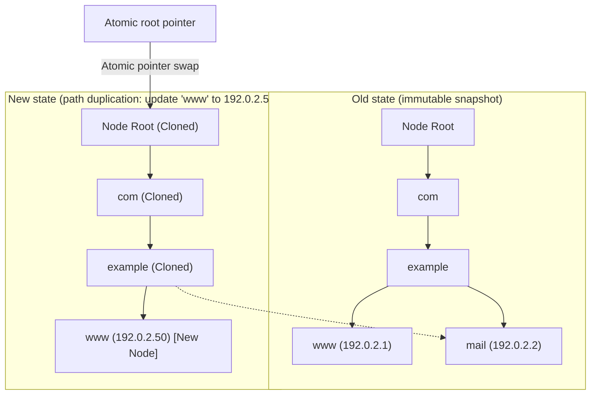

# In-memory radix tree routing

KDNS routes domain lookups using an in-memory **radix tree** indexed in reverse label order.

---

## 1. Why reverse-label routing?

Standard hash maps (`map[string]RecordSet`) don't fit DNS lookups well:
1. **No hierarchical context:** Finding parent zone cuts (`NS`) or enclosing zone apexes (`SOA`) requires repeated string chopping and synthetic map lookups.
2. **Wildcards:** Resolving wildcards (`*.example.com`) requires checking every parent level individually.
3. **Empty non-terminals (ENT):** If `a.b.example.com` exists but `b.example.com` has no records, a flat map cannot easily tell that `b` is a valid domain that shouldn't fall back to a wildcard.

KDNS indexes labels in **reverse order from right to left** (Root `.` &rarr; TLD &rarr; Apex &rarr; Subdomains):

```
                                  [ . (Root) ]
                                       |
                                    [ com ]
                                       |
                                  [ example ]
                                   /   |   \
                             [ www ] [ * ] [ app ]
                                       |
                                    [ dev ]
```

---

## 2. Copy-on-Write and lock-free reads

Reads (DNS queries, API lookups, and zone exports) are **100% lock-free** and never wait behind writers.



### How writes work:
1. Writers take the storage write lock.
2. Only nodes along the modified path are cloned (Path Duplication). Unmodified sibling branches (like `mail` above) are shared via pointers without copying.
3. The root pointer is swapped atomically.
4. Active readers holding the previous root continue reading their snapshot safely with zero lock contention.

---

## 3. RFC 4592 wildcards and ENT rules

- **Exact match first:** An exact record (e.g. `www.example.com`) always overrides a wildcard (`*.example.com`).
- **Wildcard fallback:** If no exact match exists, resolution falls back to the nearest parent wildcard (`*`).
- **ENT suppression:** If a domain exists purely as a parent node (e.g. `a.b.example.com` exists), queries for `b.example.com` return `NOERROR / NODATA` with an SOA in the Authority section, suppressing wildcard fallthrough.

---

## 4. RFC 1034 §3.6.2 CNAME handling

- If the query is for `CNAME` or `ANY`, KDNS returns the CNAME record directly.
- For any other query type (like `A` or `AAAA`), KDNS returns the `CNAME` in the **Answer section** with `AA=1`.
- Chasing the CNAME target is left to the recursive resolver.

---

## 5. RFC 1034 §4.3.2 Zone cuts and delegations

When a query targets a name below an active delegation boundary (`NS` records at `sub.example.com`):
1. Traversal intercepts the delegation cut.
2. KDNS returns a **Delegation referral**:
   - Header: `AA=0` (Not Authoritative), `RCode=NOERROR`.
   - **Authority section:** The `NS` records of the delegated child zone.
   - **Additional section:** Glue records (`A`/`AAAA`) for the nameservers, if configured locally.

---

## 6. Zero-allocation stack iterator

The domain label iterator operates entirely on the stack:
- Labels are scanned from right to left using byte index offsets.
- In-place ASCII lowercasing runs in a 64-byte stack buffer.
- Lookups produce **zero heap allocations**, keeping the hot path fast and GC-free.
