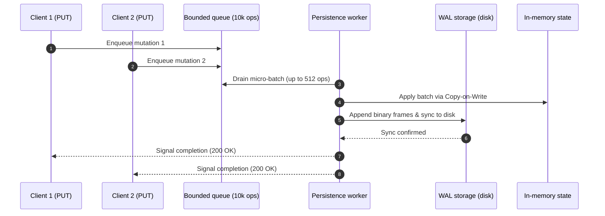
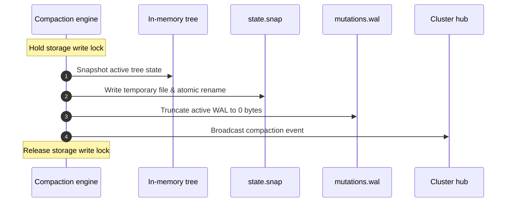

# Storage, WAL and snapshots

KDNS keeps all DNS records in memory for fast lookups, backed by a sequential Write-Ahead Log and compressed snapshots on disk for crash durability.

```
       +-------------------------------------------------------------+
       |                        Storage Engine                       |
       +------------------------------+------------------------------+
                                      |
                    +-----------------+-----------------+
                    |                                   |
                    v                                   v
       +------------------------+          +------------------------+
       |    State Checkpoint    |          |    Write-Ahead Log     |
       |      `state.snap`      |          |    `mutations.wal`     |
       |   (Deflate Compressed) |          |  (Sequential Stream)   |
       +------------------------+          +------------------------+
```

---

## 1. Bootstrapping from zone files

If you provide an RFC 1034 / RFC 1035 master zone file via `--zone-file`:

1. **First boot:** In an empty storage directory (no `state.snap`), KDNS parses the zone file directly into memory.
2. **Initial snapshot:** It immediately writes a compressed baseline snapshot (`state.snap`) to disk.
3. **Subsequent boots:** On future starts, KDNS ignores the static zone file and loads straight from `state.snap` plus any uncompacted frames in `mutations.wal`.

---

## 2. Group commit batching

Mutations from the REST API or RFC 2136 dynamic updates are grouped together to reduce disk I/O:



- Up to 512 operations are flushed in a single disk sync (or after a 2ms timer).
- Callers block until their batch is durably written to disk.

---

## 3. Binary WAL format (`mutations.wal`)

Every mutation is appended as a binary frame with a trailing CRC32-IEEE checksum:

### Upsert frame (`0x01`):
| Field | Type | Description |
| :--- | :--- | :--- |
| `Opcode` | `uint8` | `0x01` (`OpUpsert`) |
| `Codec Payload` | `[]byte` | Binary encoded domain name and resource records |
| `Checksum` | `uint32` | CRC32-IEEE checksum over Opcode + Payload |

### Delete frame (`0x02`):
| Field | Type | Description |
| :--- | :--- | :--- |
| `Opcode` | `uint8` | `0x02` (`OpDelete`) |
| `DomainLength` | `uint16` | Byte length of the domain name |
| `DomainName` | `string` | Canonical lower-case ASCII domain name |
| `Checksum` | `uint32` | CRC32-IEEE checksum over Opcode + Length + Name |

---

## 4. Compressed snapshots (`state.snap`)

When a checkpoint is created, the full in-memory tree is serialized into a single compressed binary file:

- **Deflate stream compression:** Reduces disk footprint by roughly **94%** compared to raw JSON or text zone files.
- **Integrity check:** A trailing 32-bit CRC32 checksum is verified before state deserialization.
- **Safe atomic replacement:** The snapshot is written to a temporary file (`state-snap-*.tmp`) with restrictive permissions (`0600`), synced to disk, and renamed atomically to `state.snap`.

---

## 5. Background compaction

To prevent the WAL file from growing indefinitely, KDNS compacts it in the background:

- **Compaction threshold:** Triggers after `10,000` mutations (minimum guardrail: `100`).
- **Compaction interval:** Runs periodically every `30m` (minimum guardrail: `1m`).



Holding the write lock during compaction ensures that no new mutations can be written to the old WAL while the snapshot is written. In-flight requests queue cleanly in memory and are written to the new WAL as soon as the lock is released.
